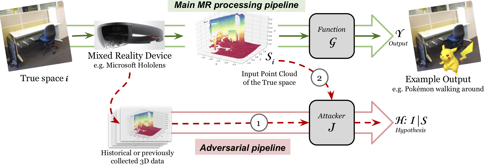
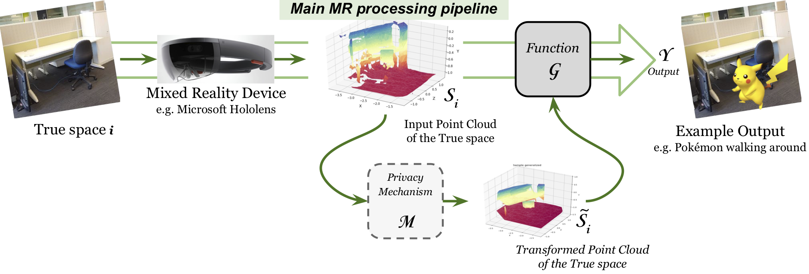
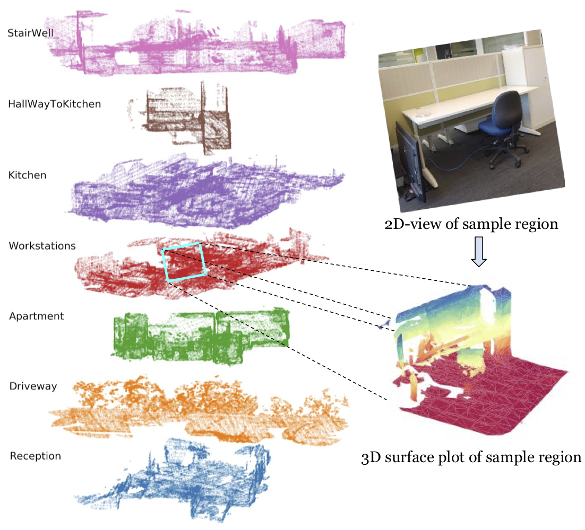

# 3D Spatial Privacy

# ABSTRACT
Augmented reality (AR) or mixed reality (MR) platforms require spatial understanding to detect objects or surfaces, often including their structural (i.e. spatial geometry) and photometric (e.g. color, and texture) attributes, to allow applications to place virtual or synthetic objects seemingly "anchored'' on to real world objects; in some cases, even allowing interactions between the physical and virtual objects. These functionalities requires AR/MR platforms to capture the 3D spatial information with high resolution and frequency; however, this poses unprecedented risks to user privacy. Aside from objects being detected, spatial information also reveals the location of the user with high specificity, e.g. in which part of the house the user is. In this work, we propose to leverage *spatial generalizations* coupled with *conservative releasing* to provide spatial privacy while maintaining data utility. We simulate user movement within spaces which reveals more of their space as they move around. Then, we designed an inference attacker to which the proposed spatial privacy approach can be evaluated against. Results show that revealing no more than 11 generalized planes--accumulated from revealed spaces with large enough radius, i.e. *r*≤1.0m--can make an adversary fail in identifying the spatial location of the user for at least half of the time. Furthermore, if the accumulated spaces are of smaller radius, i.e. *r*≤ 0.5m, we can release up to 29 generalized planes while enjoying both better data utility and privacy.

# BACKGROUND

  
   
  <b>Figure 1:</b> A generic information flow for a desired MR functionality G with an attacker J which can perform adversarial inference off line to determine the space the user is in as well as the objects within the space: (1) adversarial inference modeling or learning from, say, historical 3D data, and (2) adversarial inference or matching over currently released 3D data 

  
   
  <b>Figure 2:</b> Inserting an intermediate privacy-preserving mechanism M which aims to prevent spatial inference 

AR/MR platforms such as , , and  requires spatial understanding of the user environment in order to deliver virtual augmentations that seemingly inhabit the real world, and, in some immersive examples, even interact with physical objects. The captured spatial information is stored digitally as a spatial map or graph of 3D points, called a *point cloud*, which is accompanied by mesh information to indicate how the points, when connected, represent surfaces and other structures in the user environment. However, these 3D spatial maps that may contain sensitive information, which the user did not intend to expose, can %be stored and, then, accessed by a potential adversary (as shown in Fig. 1) and be further utilized for functionalities beyond the application's intended function such as aggressive localized advertisements. And, so far, there are no mechanisms in place that ensure user data privacy in MR platforms.

In light of this, first, we present an attacker that not only recognizes the general space, i.e. *inter-space*, but also infers the user’s location within the space, i.e. *intra-space*. To construct the attacker, we build up on existing place recognition methods that have been applied on 3D lidar data and modify it to the scale on which 3D data is captured by MR platforms. We demonstrate how easy it is to extend these 3D recognition methods to be used as an attacker in the MR scenario. Then, we present *spatial plane generalizations* with *conservative plane releasing* as a simple privacy approach which we insert as an intermediary layer of protection as shown in Fig. 2.

# SAMPLE CODE
The notebook  contains a step-by-step replication of the work at a smaller scale. As one can inspect, we vary the following parameters on both Raw spaces and [RANSAC] generalized spaces: 
1. the size, i.e radius, of the revealed space
2. the number of successively released partial spaces
3. the number of *generalized* planes released

# DATASET

  
   
  <b>Figure 3:</b> 3D point clouds of the 7 collected environments (left); a 3D surface of a sample space (bottom-right), and its 2D-RGB view (top-right) 

For our dataset, we gathered real 3D point cloud data using the Microsoft HoloLens in various environments to demonstrate the leakage from actual human-scale spaces in which an MR device is usually used. As shown in Fig. 3, our collected environments include the following spaces: a work space, a reception area, an office kitchen or pantry, an apartment, a drive way, a hall way, and a stair well.
